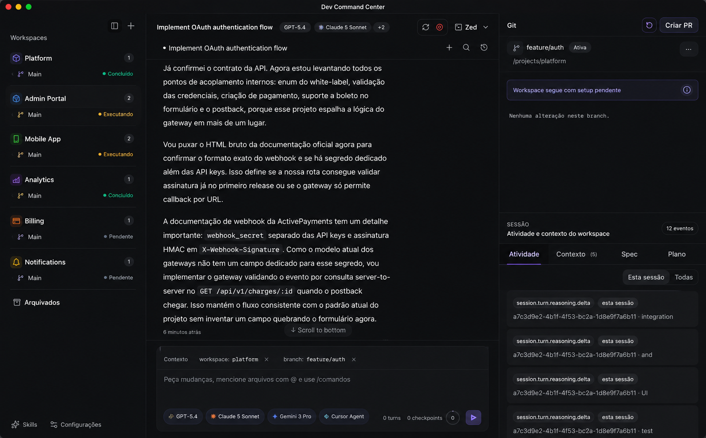

# Dev Command Center

Dev Command Center (DCC) is a local-first desktop workbench for software engineering with AI agents. It combines isolated Git worktrees, terminal execution, session orchestration, provider integrations, and local persistence in a single Tauri application.



## Core capabilities

- Worktree-first task isolation for parallel changes without `git stash`.
- Multi-provider execution flows for tools such as Claude, Gemini, and Codex.
- Local session state, event replay, and workspace-aware runtime surfaces.
- Native terminal integration and repository inspection from the desktop shell.
- Optional mobile pairing and local HTTP access for companion workflows.

## Stack

- Tauri 2 + Rust
- React 19 + TypeScript + Vite
- SQLite for local persistence
- xterm.js for terminal surfaces

## Requirements

- Node.js 22 recommended
- Yarn v1
- Rust stable
- Git

## Development

Recommended setup:

```bash
./setup.sh
```

Manual setup:

```bash
yarn install
yarn dev
```

Desktop-only frontend shell:

```bash
yarn dev:desktop
```

## Worktrees and `.env`

Environment files are ignored by Git. For a new clone or worktree:

```bash
yarn setup-worktree
```

If no shared `.env` is found, the setup script falls back to `.env.example`.

## Repository notes

- The project is open source under Apache-2.0.
- Signed release distribution is currently focused on macOS and Linux.
- Licensed under Apache-2.0. See [LICENSE](LICENSE).

## Downloads

- Releases page: <https://github.com/wharley/DevCommandCenter/releases>
- Signed builds are published for macOS and Linux through GitHub Releases.
- Public releases are signed for this repository. Forks that want their own downloadable builds should publish from their own repository with their own signing keys and release endpoint.

## CI and releases

- GitHub Actions provide manual validation workflows for Linux and macOS.
- Signed public releases are prepared through GitHub Releases via `.github/workflows/publish-release.yml`.
- Public release publication is intentionally limited to manual dispatch or version tags.
- The in-app updater is configured to read `latest.json` from GitHub Releases after the first signed release is published.
- Validation workflows and release publishing are intentionally separated so signing secrets stay isolated to the protected `release` environment.

## Available docs

- [Mobile pairing security model](docs/SECURITY_MOBILE_PAIRING.md)
- [Security policy](SECURITY.md)
- [Contributing guide](CONTRIBUTING.md)
- [Support](SUPPORT.md)
- [Release guide](docs/RELEASING.md)
- [GitHub release bootstrap](docs/GITHUB_RELEASE_BOOTSTRAP.md)
- [GitHub repository settings](docs/GITHUB_REPOSITORY_SETTINGS.md)
- [Open source release checklist](docs/OPEN_SOURCE_RELEASE_CHECKLIST.md)
