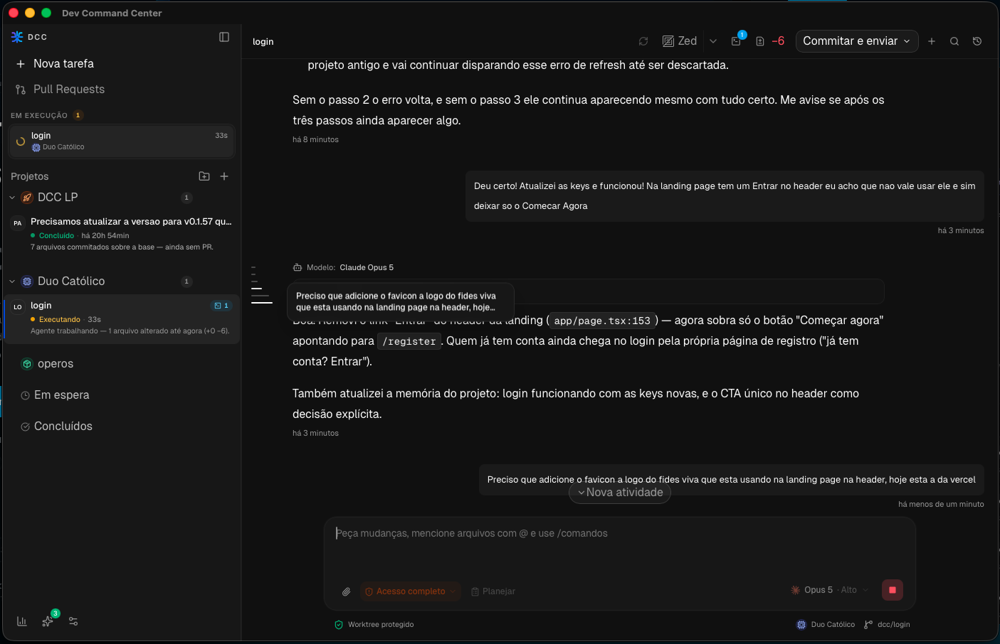

<p align="center">
  <a href="docs/BRAND.md">
    
  </a>
</p>

<h1 align="center">Dev Command Center</h1>

<p align="center">
  Workspace-first AI coding hub for managing agents, reviews, terminals, and task flows across multiple providers.
</p>

Dev Command Center (DCC) is a local-first desktop workbench for software
engineering with AI agents. It connects isolated Git worktrees, multi-provider
sessions, review and delivery workflows, terminals, usage insights, and local
persistence in one Tauri application.



## Core capabilities

- **Workspace-first agent sessions**: run AI coding work inside isolated Git worktrees while keeping session history, runtime context, terminals, and reviews connected to the active workspace.
- **Last Turn Review and Guarded Undo**: inspect the exact result of a completed agent turn and, for eligible macOS workspaces, preview and safely restore the previous file contents. See [Last Turn Review and Guarded Undo](docs/GUARDED_UNDO.md).
- **Pull Request Center**: review GitHub pull requests and GitLab merge requests, inspect checks and discussions, publish review actions, create isolated implementation tasks, and directly merge eligible GitHub PRs with an explicitly confirmed strategy.
- **Delegation agents**: hand off review, explanation, or implementation tasks to child sessions, inspect their work in the Inspector, send feedback back to the child agent, and apply or discard the isolated worktree output. See [Delegation agents](docs/DELEGATION_AGENTS.md).
- **Git and delivery workflows**: inspect live changes, commit and push, create or update change requests, recover delivery failures, and resolve merge conflicts without leaving the workbench.
- **Managed MCP integrations**: connect trusted local or remote tools with scoped bindings, OS-backed credential storage, runtime status, and per-tool Ask/Allow/Deny policies.
- **Usage and skills**: compare real provider activity, inspect token and model usage, and manage project skills from a provider-neutral source.
- **Mobile companion pairing**: pair a phone with the desktop app through QR code + PIN and use companion workflows on the same trusted network or through Tailscale. See [Mobile web companion](docs/MOBILE_WEB.md).
- **Provider-neutral workflows**: use Claude, Gemini, Codex, Cursor, and other provider integrations from the same workbench surface.
- **Provider handoff**: select another provider inside an existing session and send the next turn normally; DCC automatically attaches one bounded, provider-neutral re-anchor. DCC persists the timeline, but the new runtime does not receive native 1:1 memory and a new thread starts fresh. See [Provider handoff](docs/PROVIDER_HANDOFF.md).
- **Built-in review surface**: inspect changed files, inline diffs, annotations, branch status, CodeRabbit feedback, validations, and PR-ready state without leaving DCC.

## What you can do in DCC

- Create isolated workspaces and Git worktrees for parallel tasks without juggling `git stash`.
- See active tasks from every project in one Running section and track completed worktree storage before permanent deletion.
- Run agent workflows across providers such as Claude, Gemini, Codex, and Cursor from the same desktop surface.
- Keep local session history, replay prior activity, and preserve workspace-specific runtime context.
- Open embedded project terminals with tabs for repo-level work that should stay inside the app.
- Open the active workspace in a preferred editor such as Cursor, Zed, or VS Code.
- Review the current workspace or isolate the latest agent turn, with a guarded restore when its safety capture is eligible.
- Inspect pull requests, discussions, checks, approvals, conflicts, and merge readiness from a dedicated hub.
- Create readable semantic `dcc/`, `dcc/fix/`, and `dcc/feat/` branches from task titles while preserving existing user branches.
- Resolve Git conflicts with index-backed ours/theirs/result controls and optional agent assistance.
- Drive plan mode, mission specs, and follow-up implementation flows from the same session.
- Manage project skills from a provider-neutral source and compile them into agent-native targets such as `.claude/skills/`, `AGENTS.md`, `GEMINI.md`, and `.cursor/rules/`.
- Connect DCC-managed MCP servers to compatible providers without editing provider-owned configuration.
- Compare provider, model, token, cache, reasoning, and cost activity recorded by DCC.
- Use optional mobile pairing and local HTTP access for companion workflows on the same trusted network.

## Product shape

- Workspace-first: the main unit is an isolated task workspace tied to a repository and branch context.
- Local-first: state, sessions, and runtime surfaces stay on your machine.
- Human-controlled: agents can implement and prepare delivery, while destructive actions, permissions, reviews, merges, and restores stay explicit.
- Agent-aware: DCC is not just a terminal wrapper; it keeps plans, specs, diffs, session events, permissions, usage, and provider context connected inside one workbench.

## Stack

- Tauri 2 + Rust
- React 19 + TypeScript + Vite
- SQLite for local persistence
- xterm.js for terminal surfaces

## Requirements

- Node.js 22 recommended
- Yarn v1
- Rust stable
- Git

## Development

Recommended setup:

```bash
./setup.sh
```

Manual setup:

```bash
yarn install
yarn dev
```

Desktop-only frontend shell:

```bash
yarn dev:desktop
```

## Worktrees and `.env`

Environment files are ignored by Git. For a new clone or worktree:

```bash
yarn setup-worktree
```

If no shared `.env` is found, the setup script falls back to `.env.example`.

## Repository notes

- The project is open source under Apache-2.0.
- Signed release distribution is currently focused on macOS and Linux.
- Licensed under Apache-2.0. See [LICENSE](LICENSE).

## Acknowledgments

DCC was shaped by the broader ecosystem of AI coding tools, terminal-native developer workflows, local-first apps, and worktree-based development practices.

## Downloads

- Releases page: <https://github.com/wharley/DevCommandCenter/releases>
- Signed builds are published for macOS and Linux through GitHub Releases.
- macOS public release artifacts are signed/notarized app bundle archives (`.app.tar.gz`) for the updater.
- Linux public release artifacts are currently distributed as Debian packages (`.deb`) in the public release pipeline.
- Public releases are signed for this repository. Forks that want their own downloadable builds should publish from their own repository with their own signing keys and release endpoint.

## CI and releases

- GitHub Actions provide manual validation workflows for Linux and macOS.
- Signed public releases are prepared through GitHub Releases via `.github/workflows/publish-release.yml`.
- Public release publication is intentionally limited to manual dispatch or version tags.
- Manual release dispatch can target `all`, `linux-x64`, `macos-arm64`, or `macos-intel`.
- The in-app updater is configured to read `latest.json` from GitHub Releases after the first signed release is published.
- Validation workflows and release publishing are intentionally separated so signing secrets stay isolated to the protected `release` environment.

## Project docs

- [Brand identity](docs/BRAND.md)
- [Security policy](SECURITY.md)
- [Contributing guide](CONTRIBUTING.md)
- [Support](SUPPORT.md)
- [Release guide](docs/RELEASING.md)
- [Codex orchestration](docs/CODEX_ORCHESTRATION.md)
- [Last Turn Review and Guarded Undo](docs/GUARDED_UNDO.md)
- [Guarded Undo engineering contract](docs/GUARDED_UNDO_DESIGN.md)
- [Delegation agents](docs/DELEGATION_AGENTS.md)
- [Mobile web companion](docs/MOBILE_WEB.md)
- [Mobile pairing security model](docs/SECURITY_MOBILE_PAIRING.md)
- [MCP trust model](docs/MCP_TRUST_MODEL.md)
- [CodeRabbit integration](docs/CODERABBIT.md)
- [Git conflict resolution](docs/GIT_CONFLICT_RESOLUTION.md)
- [Delivery workflows roadmap](docs/DELIVERY_WORKFLOWS_ROADMAP.md)
- [Antigravity provider](docs/ANTIGRAVITY_PROVIDER.md)
- [Browser workbench](docs/BROWSER_WORKBENCH.md)
- [Monaco Editor in Tauri](docs/MONACO_TAURI.md)
