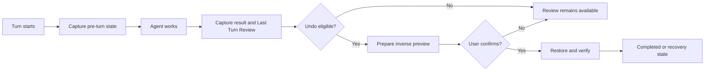

# Last Turn Review and Guarded Undo

Dev Command Center captures the result of a completed agent turn so you can
review exactly what that turn changed. On supported workspaces, Guarded Undo
adds a second safety capture that can restore the file contents from immediately
before the turn.

These are related but distinct features:

- **Last Turn Review** is historical evidence: changed files, rendered diffs,
  validations, outcome, and compatibility with the current workspace.
- **Guarded Undo** is a verified restoration operation. It uses separately
  captured raw preimages and never treats a rendered diff as a restore source.

Seeing a Last Turn diff does not necessarily mean that Undo is available.

## Current availability

- Last Turn Review is available wherever DCC can capture the turn result.
- Guarded Undo is currently a macOS beta in the desktop build.
- Other platforms and unsupported filesystems fail closed: the review remains
  available, but DCC does not offer an unsafe restore.
- Guarded Undo currently restores file content only. It does not reverse
  commits, pushes, pull requests, branch changes, staging, or external effects.

## Lifecycle

1. Before provider input is sent, DCC observes the workspace identity, Git
   state, and supported tracked files.
2. The agent turn runs normally. A capture failure never suppresses the turn's
   completion event.
3. At the terminal edge, DCC captures the review result and classifies the
   restoration set as eligible, ineligible, failed, or unavailable.
4. An eligible review exposes **Undo last turn** / **Desfazer último turno**.
5. Selecting Undo performs a read-only preparation and shows inverse previews,
   the target file count, total size, and confirmation expiry.
6. Only explicit confirmation starts restoration. DCC rechecks the workspace,
   writes a durable recovery journal, exchanges the target files, and verifies
   the final result.

Closing the preview changes nothing. The confirmation token is single-use and
expires after two minutes.

## What is eligible today

The first restoration scope is intentionally conservative. A turn is normally
eligible only when:

- it uses one registered Git worktree on a supported macOS filesystem;
- `HEAD`, the checkout kind or checked-out branch, and the Git index are
  unchanged across the observed turn boundaries;
- every affected path is an existing tracked regular file modified in place;
- file type, ownership, permissions, and link semantics remain stable; normal
  atomic editor saves are supported and bind Undo to the new result identity;
- no non-ignored untracked path exists at either capture boundary; and
- the capture fits the configured file, byte, index, and time limits.

Common examples that make a capture ineligible include:

| Reason | Meaning |
| --- | --- |
| `untracked_path` | A non-ignored untracked path existed. DCC does not read or guess its previous content. |
| `index_changed` | Staged/index state changed during the observed turn. Undo does not rewrite the index. |
| `head_changed` or `ref_changed` | A commit, checkout, reset, or branch movement changed Git identity. |
| `unsupported_status` | The turn added, deleted, renamed, copied, or conflicted a path instead of only modifying an existing file. |
| `git_filter_present` | A clean/process filter, working-tree encoding, or similar conversion makes raw restoration ambiguous. |
| `hardlink_unsupported`, `symlink_or_reparse_point`, or `submodule` | The path type is outside the reviewed content-only contract. |
| `capture_timeout` or a size-limit reason | The repository or affected set exceeded the bounded capture budget. |

Ineligibility is a safety classification, not a task failure and not something
the user is expected to repair. The agent result, conversation, and Last Turn
Review continue to work normally.

## Using Undo

1. Open the task and select **Last turn** / **Último turno** in Changes.
2. Check the Guarded Undo status below the captured review.
3. If protected, select **Undo last turn** / **Desfazer último turno**.
4. Review every inverse preview and the scope warning.
5. Select **Restore _n_ files** / **Restaurar _n_ arquivos**.
6. Wait for preparation, restoration, and final verification to finish.

Later changes to unrelated files are not Undo targets. A later change to a
target file, `HEAD`, branch, index, repository identity, or relevant metadata
blocks automatic Undo before DCC overwrites the workspace.

## Outcomes and recovery

| Status | What happens |
| --- | --- |
| `completed` | Every target was restored and verified. The capture becomes consumed. |
| `blocked` | A safety check failed before files changed. Review the current diff and retry only after understanding the new state. |
| `rolled_back` | Restore could not finish, but DCC safely returned every affected file to its pre-Undo content. |
| `recovery_required` | DCC observed unexpected content and preserved the recovery journal instead of overwriting it. Refresh the recovery status and do not start another restore for that workspace. |

If DCC is interrupted after restoration starts, startup recovery compares the
journal, workspace, preimages, and displaced files. It only continues or rolls
back when both sides still match their recorded identities. Ambiguous content
is retained for manual recovery.

## Completing and deleting tasks

Completing a task keeps its worktree and history so it can still be reviewed or
restored. Permanent deletion has a separate lifecycle:

- eligible, ineligible, failed, expired, and consumed captures are ordinary task
  history and are discarded automatically with the task;
- a genuinely active Undo or recovery operation blocks deletion before DCC
  removes the remote branch or worktree;
- the UI directs the user to Last Turn to refresh that recovery state; and
- deletion is repeatable if a previous attempt already removed the branch or
  worktree.

Guarded Undo availability never requires a user to keep a completed task.

## Storage and privacy

Restoration preimages can contain local source code. DCC stores them in a
private app-data artifact directory with opaque names and restrictive local
permissions. They are excluded from transcripts, full-text search, diagnostics,
crash reports, and telemetry.

The current implementation is plaintext at rest. Default retention is seven
days, with count and storage budgets. Permanent task deletion discards its
restore-set records; orphan artifact cleanup is reconciled by the guarded
artifact store.

## Limits of the promise

Guarded Undo is fail-closed local recovery, not a filesystem transaction and
not protection against a malicious same-user process. External editors,
terminals, hooks, and other programs can still race with DCC. The implementation
therefore verifies identities repeatedly and stops when it cannot prove that an
automatic write is safe.

For the normative engineering contract, persistence model, reason codes,
platform adapter requirements, and test matrix, see
[Guarded Undo design](GUARDED_UNDO_DESIGN.md).
