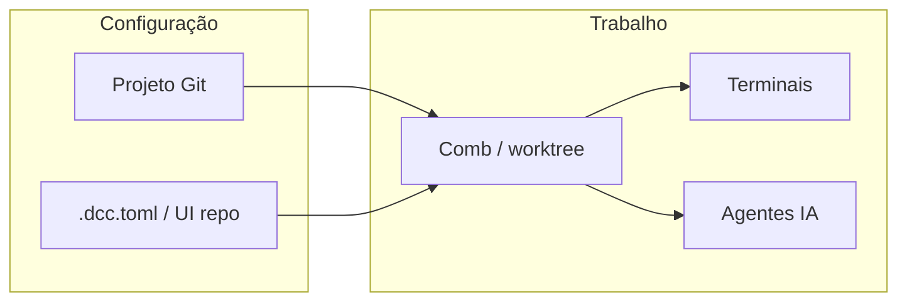
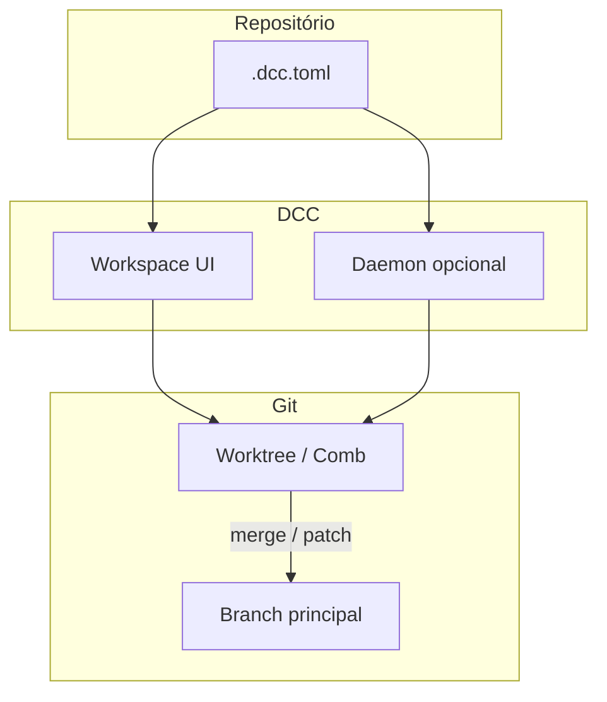

# Guia de recursos e fluxos — Dev Command Center (DCC)

Este guia descreve **como usar** as capacidades atuais do DCC e propõe **fluxos de trabalho** que combinam vários recursos para extrair o máximo valor. O **roteiro passo a passo** (numerado, com checkpoints) está na **secção 4**. Complementa a visão estratégica de [`MELHORIAS_INSPIRADAS_ARBOR.md`](./MELHORIAS_INSPIRADAS_ARBOR.md) (paridade inspirada no [Arbor](https://github.com/penso/arbor)) com foco em **ação no dia a dia**.

**Leitura relacionada**

- [Guia de produtividade](GUIA_DE_PRODUTIVIDADE.md) — worktrees, panes, atenção, dependências.
- [Política de worktrees](WORKTREE_POLICY.md) — caminhos e limpeza.
- [Arquitetura](ARCHITECTURE.md) — visão técnica.

---

## 1. O que o DCC é (em uma frase)

Um **ambiente local-first** (Tauri + SQLite + Git worktrees) onde você isola tarefas em **workspaces (Combs)**, corre **terminais e agentes de IA** lado a lado, automatiza com **config de repositório** (`.dcc.toml`), e opcionalmente liga um **daemon** para **processos supervisionados**, **tarefas agendadas** e integração **CLI / MCP** — sem depender de um IDE específico para orquestrar o fluxo.

---

## 2. Mapa rápido: recurso → onde usar → benefício

| Área | Onde na app | Benefício principal |
|------|-------------|---------------------|
| **Projeto Git** | Adicionar projeto, sidebar | Raiz de tudo: caminho do repo, providers, config. |
| **Comb (workspace)** | Novo workspace, lista na sidebar | Uma **branch + worktree** por tarefa — isolamento real no disco; **pré-visualização** de branch/pasta ao escrever o nome; opcional **carregar issue** (GitHub/GitLab) para preencher nome/descrição; lista ordenada por fixados e **última atividade Git** (reflog/commit/index), com tempo relativo por workspace quando disponível. |
| **Panes (terminal / agente)** | Botões Workspace, Base, Novo agente; **⌘⇧T** / **⌘⇧A** / **⌘⇧B** | Paralelismo: testes, servidor e agente no mesmo contexto; **agente** usa provider CLI de **Providers** e **default** do `.dcc.toml`; worktree é **garantido** antes de abrir agente. |
| **Terminal embutido** | Painel principal | PTY nativo, xterm, busca; saída com batching suave. |
| **Atenção / notificações** | Badges, toasts, **⌘⇧I** | Menos tempo a olhar para o terminal à espera. |
| **Diffs / revisão** | Painel **Review** do workspace | Diffs por ficheiro, **flags** (OK / depois / suspeito), notas, **merge** vs **patch**, estado do **principal** e da **worktree**, comentários de **PR/MR** com `forge_link`; **multi-repo** na mesma revisão. |
| **`.dcc.toml` + editor UI** | Config do repositório, diálogo TOML | Presets, processos, tasks, scripts, branch — **reprodutível em equipa**. |
| **Processos supervisionados** | Secção **Processos** na sidebar (com daemon) | Start/stop/restart, CPU/RAM, auto-restart — tipo Procfile com estado. |
| **Tarefas agendadas** | Secção **Tarefas** + palette | Cron no daemon; executar, anexar/desanexar stream. |
| **Paleta de comandos** | **⌘K** / **Ctrl+K**; grupos na lista | Saltar para projeto, comb, pane, preset, processo, template `.dcc/tasks`, task agendada; ver **[atalhos](GUIA_DE_PRODUTIVIDADE.md#6-atalhos-de-teclado-workspace)** no guia de produtividade. |
| **Atalhos globais workspace** | Teclado (ver guia) | Novo workspace (**⌘⇧N**), terminais, agente, histórico de Combs (**⌘[** / **⌘]**), temas, zoom de fonte do terminal (**⌘±**), **⌘1–9** para panes. |
| **Integração Git avançada** | Ações no workspace | Merge para main, apply patch, discard — fechar o ciclo do worktree. |
| **CLI `dcc`** | Terminal do sistema | `daemon status`, `run`/`attach`/`detach` de tasks, `mcp`. |
| **MCP** | `dcc mcp` (stdio) | Cursor / Claude Desktop / outro cliente MCP a orquestrar o daemon. |

*Itens ainda em roadmap (HTTP API do daemon, issues/PR, etc.) estão detalhados em [`MELHORIAS_INSPIRADAS_ARBOR.md`](./MELHORIAS_INSPIRADAS_ARBOR.md).*

---

## 3. Pré-requisitos de ambiente

1. **App desktop** — O DCC é pensado para **Tauri** (bridge `window.desktopAPI`, SQLite local, PTY). Funcionalidades que dependem do daemon ou de comandos nativos exigem o binário compilado.
2. **Git** — Worktrees e operações de integração assumem repositório válido e remotes quando aplicável.
3. **Daemon (`dccd`)** — Processos supervisionados e tasks agendadas funcionam com o **sidecar** (ou modo in-process em desenvolvimento). Se o daemon não estiver disponível, a UI continua útil para Combs, terminais e presets; secções que dependem de RPC mostram estado vazio ou mensagem adequada.
4. **Node no worktree** — Cada worktree pode precisar do seu próprio `yarn`/`npm`/`pnpm install` (ver [Guia de produtividade](GUIA_DE_PRODUTIVIDADE.md)).

---

## 4. Guias passo a passo (executar na ordem)

Esta secção é o **roteiro**: cada bloco tem passos **numerados** para puder seguir na app sem saltos. **4.1** é o fluxo mínimo (projeto → Comb → trabalhar); **4.2**–**4.8** são módulos opcionais (config, presets, daemon, Git, palette, CLI). Dentro de cada bloco, segue a ordem **1 → 2 → 3 → …** até ao **Checkpoint**.

### 4.1 Primeira sessão: do projeto ao trabalho num Comb

1. Abre o **DCC** (app desktop Tauri).
2. **Adiciona um projeto**: escolhe a pasta raiz do repositório Git (clone local).
3. (Opcional) Em **Definições / Settings**, configura **providers** (CLI dos agentes) se fores usar panes de agente. No **`.dcc.toml`** podes definir **agente padrão** (`defaultAgentProviderId`) para o diálogo “Novo Agent Pane” pré-selecionar o mesmo modelo em toda a equipa.
4. Na sidebar, **seleciona o projeto** (se tiveres vários).
5. Cria um **novo workspace (Comb)** (**botão +**, **⌘⇧N** ou paleta **⌘K** → “Novo workspace”):
   - Escolhe o **projeto** na lista.
   - (Opcional) Secção **Issue (GitHub / GitLab):** cola URL da issue ou `owner/repo#123`; token PAT opcional para privados; **Carregar** — o DCC preenche **nome** e **descrição** sugeridos (revê antes de criar).
   - Escreve o **nome** do workspace; observa a caixa **Branch e pasta (pré-visualização)** — mostra o nome de **branch** e **caminho** do worktree (suíxo hex de exemplo até criares de facto).
   - Escolhe a **branch base** (lista carregada do Git ou texto livre).
   - (Opcional) **Descrição** para contexto humano.
   - **Criar** — o registo do Comb fica na base local; o **worktree em disco** pode ser criado na primeira operação que precise dele (**garantir worktree** ao abrir terminal/agente).
6. Confirma que o Comb aparece na lista (branch pode ainda estar pendente até o primeiro `ensure`).
7. Se for a **primeira vez** neste worktree e o projeto tiver dependências, abre um **terminal do workspace** (**⌘⇧T** ou botão) — o DCC prepara o worktree se necessário — e corre o instalador (`yarn`, `npm ci`, `pnpm install`, etc.) **dentro da pasta do worktree**.
8. Usa **terminal do workspace** para a feature; **terminal Base** (**⌘⇧B**) só quando precisares do clone principal sem mudar de Comb.
9. (Opcional) **Novo agente** (**⌘⇧A**): escolhe o provider CLI; o worktree é garantido antes de arrancar o PTY.
10. Trabalha normalmente; abre o painel **Review** para diffs, flags por ficheiro, notas e integração Git (ver **4.6**).
11. Faz **commit** a partir do fluxo do painel Review, do **Commit…** na própria UI, ou do terminal / ferramenta Git **no diretório do worktree**.

**Checkpoint:** tens alterações no Comb, revisão no painel Review (ou diffs coerentes) e commits no branch do worktree.

---

### 4.2 Configurar o repositório (`.dcc.toml`) pela UI

1. Com o **projeto** selecionado, abre a **configuração do repositório** (atalho na palette **⌘K** ou entrada equivalente na UI — “config do repo” / repo config).
2. Preenche pelo menos: **prefixo de branch** (se a equipa usar convenção), **presets** (ex.: `lint`, `test`) com comando e pasta de trabalho (`project` vs `worktree`).
3. (Opcional) Adiciona **`[[processes]]`** (nome, comando, `cwd`, `auto_restart`) se fores usar o supervisor.
4. (Opcional) Adiciona **`[[tasks]]`** com `schedule` cron e comando.
5. Guarda. Se o projeto tiver **editor TOML** em bruto, podes rever o ficheiro completo no diálogo **TOML** e gravar.
6. Confirma que os **presets** aparecem na **sidebar** e na **palette (⌘K)** sob o grupo de presets.

**Checkpoint:** `.dcc.toml` alinhado com o repo e presets acessíveis sem editar ficheiros à mão fora do DCC.

---

### 4.3 Usar presets (sem daemon)

1. Garante que já existe pelo menos um **preset** configurado (secção **4.2**).
2. Abre a **palette** com **⌘K**.
3. Pesquisa pelo nome do preset ou navega ao grupo **Presets**.
4. Escolhe o item — o DCC lança o comando no **contexto** certo (worktree vs raiz do projeto, conforme definiste).

**Checkpoint:** um comando repetível (lint/test) corre sempre igual em qualquer máquina com o mesmo `.dcc.toml`.

---

### 4.4 Processos supervisionados (requer daemon)

1. Confirma que o **daemon** está a correr (app empacotado com sidecar; em desenvolvimento pode haver modo in-process).
2. Completa **`[[processes]]`** no `.dcc.toml` (secção **4.2**).
3. Seleciona um **Comb** desse projeto para o workspace mostrar o projeto ativo.
4. Na sidebar, abre a secção **Processos**.
5. No **painel** (parte superior), verifica a lista: estado, CPU/RAM quando em execução.
6. Usa **Iniciar** / **Parar** / **Reiniciar** conforme necessário.
7. Se quiseres ver o output interativo no ecrã, usa **Abrir no terminal** no mesmo processo (atalho por baixo do painel) para abrir um pane com o comando.

**Checkpoint:** serviços longos (API, worker) geridos pelo supervisor; interação humana opcional no terminal.

---

### 4.5 Tarefa agendada (cron, requer daemon)

1. Define uma entrada **`[[tasks]]`** no TOML: `name`, `command`, `schedule` (cron), `cwdMode`, `enabled`.
2. Grava a config (secção **4.2**).
3. Na sidebar **Tarefas**, localiza a task e verifica o estado (idle / agendada / em execução, conforme UI).
4. Clica **Executar** para teste manual imediato.
5. (Opcional) Usa **Anexar** / **Desanexar** para ligar ou não o output ao fluxo de sessão.
6. Para atalho, usa **⌘K** → grupo **Tasks**.

**Checkpoint:** rotina repetível sem abrir o CI só para um `git fetch` ou relatório.

---

### 4.6 Revisar e integrar na branch principal (painel Review)

O painel **Review** concentra o ciclo **ver → classificar → commit/push → merge ou patch** sem depender só da linha de comandos.

1. Com o **Comb** ativo, abre o separador/painel **Review** (diffs relativos à base; vários ficheiros em árvore).
2. **Por ficheiro:** marca **OK**, **rever depois** ou **suspeito**; o estado guarda-se localmente por *target* de revisão. Usa a **trilha** (trail) para ver o histórico curto de ações na sessão.
3. **Lê os alertas:** se o **repositório principal** (clone na raiz do projeto) tiver alterações por commitar, **merge** e **patch** no principal ficam bloqueados até commitares, stash ou **descartares no principal** — evita merges falhados por ficheiros sujos fora da worktree. Da mesma forma, com alterações por commitar **na worktree**, o merge integra o **branch**, não o working tree: faz **Commit…** ou descarta na Missão primeiro.
4. **Branch de destino:** escolhe no seletor a branch do **repo principal** para onde queres integrar (ex. `main`).
5. **Passo worktree — Missão:** **Pull** no branch da Missão se precisares de alinhar com o remoto; **Commit…** e **Push** quando estiver pronto; opcionalmente **Descartar** alterações locais na worktree (reset) com confirmação.
6. **Integração no principal:**
   - **Merge** — caminho normal: integra o branch da Missão na branch de destino no repositório principal (histórico preservado).
   - **Aplicar (patch)** — aplica diffs no checkout principal (casos pontuais; ver colapsável “merge vs patch” na UI).
7. Se ligaste um **PR/MR** (`forge_link`) e token, usa o painel de **comentários de review** para alinhar com o código (GitHub / GitLab conforme backend).
8. **Vários repositórios:** se adicionaste **outros projetos do Hive a esta revisão**, cada *target* tem a sua secção `RepoReviewSection` — vês **tokens entre repos** quando o mesmo símbolo aparece em mais do que um checkout.
9. Depois do merge na remota / política da equipa, **remove o Comb** na sidebar **só quando** não precisares mais do worktree — confirma avisos sobre commits não enviados.

**Checkpoint:** código revisto com flags, integrado por merge ou patch de forma controlada; worktree antigo removido para libertar disco (ver [WORKTREE_POLICY](WORKTREE_POLICY.md)).

---

### 4.7 Paleta de comandos e atalhos em 30 segundos

1. Carrega **⌘K** (macOS) ou **Ctrl+K** (Windows/Linux) para abrir a paleta. **⌘⇧K** / **Ctrl+Shift+K** limpa o **scrollback** do terminal ativo (ação separada, não abre a paleta).
2. Escreve parte do nome: **projeto**, **Comb**, **pane**, **preset**, **processo** do `.dcc.toml`, **template** em `.dcc/tasks` ou **task** agendada.
3. Usa as **setas** e **Enter** para executar; grupos **Histórico de workspaces**, **Temas** e **Global** estão sempre visíveis com os respetivos atalhos.

Lista completa de atalhos do workspace (incl. **⌘⇧N**, **⌘⇧T**, **⌘⇧A**, **⌘[** / **⌘]**, **⌘1–9**, zoom): **[Guia de produtividade — secção 6](GUIA_DE_PRODUTIVIDADE.md#6-atalhos-de-teclado-workspace)**.

**Checkpoint:** navegação e ações frequentes sem percorrer toda a sidebar.

---

### 4.8 CLI rápida (terminal do sistema)

1. Instala ou localiza o binário **`dcc`** (build do projeto / PATH).
2. `dcc daemon status` — confirma contacto com o daemon.
3. `dcc daemon tasks` — lista tasks (útil para obter IDs).
4. `dcc daemon run <project-id> <task-id>` — execução manual fora da GUI.
5. `dcc mcp` — inicia o servidor MCP para o cliente (Cursor, etc.) quando precisares de integração externa.

**Checkpoint:** as mesmas capacidades do núcleo, scriptável.

---

## 5. Fluxo base: projeto → comb → panes



1. **Registe o projeto** (caminho do repositório) e, se necessário, **providers** (CLI dos agentes) em Definições.
2. Crie um **Comb** com nome claro (ex.: `feat-api-pagamentos`). O DCC prepara o **worktree** e a branch conforme a política do repo.
3. Abra **terminais** (workspace = diretório do worktree; **base** = raiz do clone principal) e/ou **panes de agente** para delegar tarefas.
4. Use o painel **Review** (diffs, flags, merge/patch) para rever e integrar com controlo.

Este fluxo sozinho já reduz troca de contexto e custo cognitivo em relação a um único checkout.

---

## 6. Configuração do repositório (`.dcc.toml`)

O ficheiro (e o editor na UI) concentram a **fonte de verdade** partilhável com a equipa:

| Secção | Uso típico |
|--------|------------|
| `[branch]` / prefixo | Nomes de branch previsíveis (`dcc/...` ou prefixo de equipa). |
| `[scripts]` | `setup` ao criar worktree, `teardown` ao remover (automatizar instalação). |
| `[[presets]]` | Comandos nomeados: lint, test, typecheck — lançáveis pela **palette** e atalhos na sidebar. |
| `[[processes]]` | Serviços longos (API, worker) geridos pelo **supervisor** do daemon: estado, métricas, reinício. |
| `[[tasks]]` | Jobs com **cron** (daemon): relatórios, sync, pipelines leves. |

**Sugestão:** comece com **presets** (baixo atrito) e evolua para **processes** quando precisar de serviços sempre ligados e **tasks** quando precisar de horários.

---

## 7. Daemon: quando entra na jogada

O **daemon** mantém estado e executa trabalho em background (scheduler, supervisor de processos, RPC via SQLite). Na prática:

- **Com daemon ativo:** vê estado das **tarefas**, **processos** (CPU, memória, reinícios), e pode **anexar** a saída de uma task a um contexto de terminal conforme a UI permitir.
- **Sem daemon:** continue a usar Combs, terminal, agentes e presets lançados como shell no pane — não há supervisor centralizado.

Integrações **MCP** e **CLI `dcc`** assumem o daemon acessível (o CLI pode arrancar o sidecar conforme implementado).

---

## 8. Processos supervisionados (sidebar)

Na secção **Processos** do workspace (com projeto e daemon):

- **Painel superior:** lista de processos definidos no `.dcc.toml` com **estado**, **métricas** e ações **Iniciar / Parar / Reiniciar**.
- **“Abrir no terminal”:** atalhos que disparam o comando num **pane** de terminal (fluxo interativo humano).

**Benefício:** alinha “servidor que tem de estar de pé” com “comando que quero ver no ecrã” — o mesmo repositório, dois modos de uso.

---

## 9. Tarefas agendadas

1. Defina `[[tasks]]` no TOML (nome, comando, `schedule` em estilo cron, `cwd` projeto vs worktree).
2. Na sidebar **Tarefas**, veja estado, **execute manualmente**, e **anexe / desanexe** para ligar o output ao fluxo de sessão quando fizer sentido.
3. Na **palette (⌘K)**, grupo **Tasks** para acesso rápido.

**Benefício:** rotinas (backup leve, `git fetch`, relatórios) sem acordar o CI para tudo.

---

## 10. Paleta de comandos (⌘K / Ctrl+K)

Agrupamentos na UI: **Global** (novo workspace **⌘⇧N**, terminal **⌘⇧T**, agente **⌘⇧A**, base **⌘⇧B**, repo **⌘⇧R**, notificações **⌘⇧I**, providers **⌘⇧P**), **Histórico de workspaces** (**⌘[** / **⌘]**), **Temas** (**⌘⌥T**, **⌘⇧D/L/S**), **Projetos**, **Workspaces**, **Panes ativos**, **Processos gerenciados**, **Presets rápidos**, **Templates .dcc/tasks**, **Tarefas agendadas**, **Foco atual**.

**Dica:** trata **⌘K** como “ir para qualquer coisa”; **segura ⌘** (ou **Ctrl**) na sidebar para revelar os mesmos atalhos nos botões.

Referência completa: [Guia de produtividade — atalhos](GUIA_DE_PRODUTIVIDADE.md#6-atalhos-de-teclado-workspace).

---

## 11. Git: integrar o trabalho do worktree

Operações expostas no **painel Review** e no fluxo do Comb:

| Ação | Quando usar |
|------|-------------|
| **Garantir worktree** | Na primeira vez que um terminal/agente precisa do checkout — cria/prepara o diretório da Missão. |
| **Commit / Push / Pull** | Na worktree, alinhar com o remoto e publicar o branch da Missão antes do merge. |
| **Merge** (para branch de destino no principal) | Feature pronta; **principal** tem de estar limpo (sem alterações locais por commitar). |
| **Aplicar (patch)** | Copiar diffs para o checkout principal — uso mais pontual; ver texto de ajuda na UI. |
| **Descartar** (worktree ou principal) | Reset controlado de alterações locais; **remover Comb** elimina workspace e worktree — confirma diálogos sobre commits não enviados. |
| **Comentários PR/MR** | Quando existe `forge_link` e credenciais — cruzar review remota com o diff local. |

Combine sempre **classificação por ficheiro** (flags) e **estado do principal** com o merge final.

---

## 12. CLI e MCP (ecossistema)

### CLI `dcc`

Exemplos (ver ajuda do binário para lista atual):

```bash
dcc daemon status
dcc daemon tasks
dcc daemon run <project-id> <task-id>
dcc daemon attach <project-id> <task-id>
dcc daemon detach <project-id> <task-id>
dcc mcp
```

**Benefício:** scripts, `launchd`, ou agentes externos disparam o mesmo núcleo que a GUI, sem duplicar lógica.

### MCP

`dcc mcp` expõe ferramentas JSON-RPC para clientes MCP (ex.: IDE com MCP). Útil para **automação agentic** sobre projetos, combs e diffs — alinhado à visão “hub” descrita nas melhorias Arbor.

---

## 13. Fluxos sugeridos (combinando benefícios)

### A) Dia de desenvolvimento “full stack” no mesmo Comb

1. Manhã: criar Comb para a feature (opcional: **carregar issue** no diálogo); correr **preset** `install` ou script de **setup** do `.dcc.toml`.
2. Ligar **processos** `web` + `api` no supervisor; deixar **terminal** com logs de teste.
3. Abrir **agente** (**⌘⇧A**) num pane para refatoração; **Base terminal** (**⌘⇧B**) noutro para consultar `main`.
4. Tarde: painel **Review** (flags, merge/patch, estado do principal); descartar Comb após integração.

*Ganho:* isolamento, paralelismo humano+IA, serviços estáveis, integração Git fechada no próprio produto.

### B) Hotfix paralelo sem matar o servidor local

1. Deixe o Comb longo a correr (servidor no processo supervisionado ou terminal).
2. Crie **segundo Comb** a partir do mesmo projeto para o hotfix.
3. Use **Base** para comparar comportamento com a árvore principal.

*Ganho:* evita `stash`/`checkout` danoso; dois worktrees físicos (ver [Guia de produtividade](GUIA_DE_PRODUTIVIDADE.md)).

### C) Automação silenciosa + revisão humana às janelas

1. Configure **tasks** cron (ex.: refresh de dependências de teste, relatório de tamanho de bundle).
2. **Anexe** a task quando quiser ver output no contexto da sessão; **desanexe** para só registos em background.
3. Use **⌘K** para disparar **presets** de verificação antes de merge.

*Ganho:* o daemon trabalha enquanto você foca em decisões; presets padronizam qualidade.

### D) Equipa com o mesmo repositório

1. Versionar `.dcc.toml` com **presets** e **processos** acordados.
2. Documentar no README do repo: “abrir DCC → preset X para bootstrap”.
3. Opcional: **MCP** para ferramentas de IA usarem os mesmos combs/panes.

*Ganho:* menos “como corro isto no meu PC?” — o DCC lê a mesma config.

---

## 14. Diagrama: do repo à integração



---

## 15. Limitações e próximos passos

Funcionalidades **ainda não** cobertas por este guia (HTTP API do daemon em modo remoto como produto, integração Issues/PR, confirmações UI adicionais, etc.) estão listadas por prioridade em [`MELHORIAS_INSPIRADAS_ARBOR.md`](./MELHORIAS_INSPIRADAS_ARBOR.md). **Nota:** o **histórico do terminal por painel** já **persiste** após reinício da aplicação (SQLite comprimido por `pane_id`; ver secção 1 e “Implementações Recentes” em MELHORIAS). Use esse documento para alinhar expectativas de roadmap com a visão Arbor.

---

## 16. Resumo

| Objetivo | O que usar |
|----------|------------|
| Menos troca de contexto | Combs + worktrees |
| Paralelismo humano + IA | Vários panes + Base |
| Repetição e disciplina | Presets + `.dcc.toml` |
| Serviços sempre ligados | Processos + daemon |
| Rotinas periódicas | Tasks + cron |
| Navegação rápida | Paleta **⌘K** / **Ctrl+K** + atalhos (ver [guia](GUIA_DE_PRODUTIVIDADE.md#6-atalhos-de-teclado-workspace)) |
| Automação fora da GUI | CLI `dcc` + MCP |
| Integração Git segura | Diffs + merge / patch / discard |

O DCC ganha força quando **não** trata cada funcionalidade isoladamente, mas quando **config de repo**, **workspace**, **daemon** e **Git** entram no mesmo hábito de trabalho — aproximando-se da promessa de um **centro de comando** para engenharia assistida por IA.
