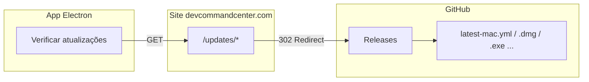

# Próximos passos: Landing, redirect de updates e releases no GitHub

Este documento descreve o que falta fazer para fechar o fluxo de **atualização in-app**: alterações na landing (devcommandcenter.com), configuração do repositório e convenções de release no GitHub. O app já está preparado para usar `https://www.devcommandcenter.com/updates` como feed; falta a camada no site e a publicação das builds.

---

## Visão geral do fluxo



1. O app chama `https://www.devcommandcenter.com/updates/latest-mac.yml` (ou `latest.yml` no Windows, etc.).
2. O site responde com **302 Redirect** para a URL do arquivo no GitHub Releases.
3. O `electron-updater` segue o redirect, baixa o `.yml` e depois o instalador (`.dmg`, `.exe`, etc.) também via redirect.

---

## 1. Repositório no GitHub

### 1.1 Nome e URL

- **Repositório do app (este):** use o nome que quiser no GitHub, por exemplo:
  - `DevCommandCenter` → URL de release: `https://github.com/<OWNER>/DevCommandCenter/releases`
- **Owner:** sua organização ou usuário (ex.: `devcommandcenter`, `seu-usuario`).

Anote:
- `GITHUB_OWNER`: dono do repositório.
- `GITHUB_REPO`: nome do repositório (ex.: `DevCommandCenter`).

URL base das releases:
`https://github.com/<GITHUB_OWNER>/<GITHUB_REPO>/releases/download/`

### 1.2 Tags de release

- Use tags no formato **`v{VERSION}`**, por exemplo: `v0.1.0`, `v0.2.0`.
- A versão deve ser a mesma do campo `version` no `package.json` no momento do build (ex.: `0.2.0` → tag `v0.2.0`).

---

## 2. Build e artefatos (electron-builder)

### 2.1 Nomes dos arquivos gerados

O `electron-builder` gera os artefatos na pasta `release/` (definida em `electron-builder.yml`). Exemplos de nomes (o `productName` é "Dev Command Center"):

| Plataforma | Exemplos de arquivos |
|------------|----------------------|
| **macOS**  | `latest-mac.yml`, `Dev Command Center-0.2.0-arm64.dmg`, `Dev Command Center-0.2.0-arm64-mac.zip`, `Dev Command Center-0.2.0-x64.dmg`, ... |
| **Windows** | `latest.yml`, `Dev Command Center Setup 0.2.0.exe`, `Dev Command Center 0.2.0.exe` (portable), ... |
| **Linux**  | `latest-linux.yml`, `Dev Command Center-0.2.0.AppImage`, `dev-command-center_0.2.0_amd64.deb`, ... |

O app solicita:
- **macOS:** `latest-mac.yml` (e a partir dele as URLs dos instaladores).
- **Windows:** `latest.yml`.
- **Linux:** `latest-linux.yml`.

### 2.2 Como gerar a build (local)

1. Atualize a versão no `package.json` (ex.: `"version": "0.2.0"`).
2. Rode o build:
   ```bash
   yarn electron:build
   ```
3. Os arquivos ficam em `release/` (ou no path definido em `directories.output`).

### 2.3 Publicar no GitHub Releases

**Opção A — Upload manual**

1. Crie uma nova release no GitHub: **Releases** → **Draft a new release**.
2. Tag: `v0.2.0` (ou a versão que estiver no `package.json`); crie a tag se não existir.
3. Título sugerido: `v0.2.0` ou `Dev Command Center v0.2.0`.
4. Faça upload de **todos** os arquivos da pasta `release/` dessa versão:
   - Todos os `latest-*.yml`.
   - Todos os instaladores (`.dmg`, `.zip`, `.exe`, `.AppImage`, `.deb`, etc.).
5. Publique a release.

**Opção B — Publicação automática (CI)**

- Configure um workflow (GitHub Actions) que:
  1. Faz checkout do repo.
  2. Instala dependências e roda `yarn electron:build` (ou equivalente).
  3. Usa `electron-builder` com publicação no GitHub, por exemplo:
     - Definir `GH_TOKEN` com um token com permissão `repo` (ou escopo de releases).
     - Comando: `electron-builder --publish always` (ou `--publish onTag` para publicar só em push de tag).
- O `electron-builder` pode publicar direto no GitHub; nesse caso o `electron-builder.yml` pode usar `publish: provider: github` em vez de `generic` **apenas para o passo de upload**. O **app** continua usando a URL do site (`https://www.devcommandcenter.com/updates`); o site é que redireciona para o GitHub.

Importante: os arquivos da release no GitHub precisam estar na **raiz** da release (não dentro de uma subpasta), porque o `electron-updater` espera URLs do tipo:
`https://github.com/<OWNER>/<REPO>/releases/download/v0.2.0/latest-mac.yml`.

---

## 3. Landing page (site devcommandcenter.com)

O repositório do **site** (landing + API de ativação) precisa expor a rota que redireciona `/updates/*` para o GitHub Releases.

### 3.1 Contrato da URL

O app faz requisições para:

- Base: `https://www.devcommandcenter.com/updates`
- Exemplos:
  - `GET /updates/latest-mac.yml`
  - `GET /updates/latest.yml`
  - `GET /updates/Dev%20Command%20Center-0.2.0-arm64.dmg`
  - `GET /updates/Dev%20Command%20Center%20Setup%200.2.0.exe`

Ou seja, tudo que vem após `/updates/` é o **nome do arquivo** (incluindo espaços codificados como `%20`).

### 3.2 Comportamento esperado do site

Para cada request em `/updates/<arquivo>`:

1. Decodificar o segmento (ex.: `Dev%20Command%20Center-0.2.0-arm64.dmg` → `Dev Command Center-0.2.0-arm64.dmg`).
2. Montar a URL do GitHub:
   - Base: `https://github.com/<GITHUB_OWNER>/<GITHUB_REPO>/releases/download/v<VERSION>/`
   - Arquivo: o mesmo nome decodificado.
   - Exemplo: `https://github.com/devcommandcenter/DevCommandCenter/releases/download/v0.2.0/Dev%20Command%20Center-0.2.0-arm64.dmg`
3. Responder com **302 Found** (ou **307**) com header `Location` apontando para essa URL.

### 3.3 De onde vem a versão (`VERSION`)

A versão usada no redirect deve ser a **versão atual da release** que você quer que o app baixe. Duas abordagens:

- **Config estática (env ou JSON):** no projeto do site, definir uma variável (ex.: `NEXT_PUBLIC_APP_RELEASE_VERSION=0.2.0` ou um `config.json`). Ao publicar uma nova release no GitHub, atualizar essa config e fazer deploy do site.
- **Dinâmica (API do GitHub):** o site chama a API do GitHub (ex.: `GET /repos/:owner/:repo/releases/latest`) e usa o `tag_name` (ex.: `v0.2.0`) para montar a URL. Assim não precisa alterar config a cada release; o redirect sempre aponta para a última release.

### 3.4 Exemplo de implementação (Next.js)

Se o site for Next.js (App Router), uma rota dinâmica pode ficar assim:

- **Arquivo:** `app/updates/[[...path]]/route.ts` (ou `pages/updates/[...path].ts` no Pages Router).

**Exemplo (App Router):**

```ts
// app/updates/[[...path]]/route.ts
const GITHUB_OWNER = process.env.GITHUB_OWNER ?? "devcommandcenter";
const GITHUB_REPO = process.env.GITHUB_REPO ?? "DevCommandCenter";
const RELEASE_VERSION = process.env.NEXT_PUBLIC_APP_RELEASE_VERSION ?? "0.2.0";

export async function GET(
  _request: Request,
  { params }: { params: Promise<{ path?: string[] }> }
) {
  const { path: pathSegments } = await params;
  const file = pathSegments?.join("/") ?? "latest-mac.yml";
  const decoded = decodeURIComponent(file);
  const base = `https://github.com/${GITHUB_OWNER}/${GITHUB_REPO}/releases/download/v${RELEASE_VERSION}`;
  const redirectUrl = `${base}/${encodeURIComponent(decoded)}`;
  return new Response(null, {
    status: 302,
    headers: { Location: redirectUrl },
  });
}
```

Nota: para sempre usar a **última** release, você pode trocar `RELEASE_VERSION` por uma chamada à API do GitHub (ex.: `repos/{owner}/{repo}/releases/latest`) e usar o `tag_name` sem o `v` (ou com, conforme a URL do GitHub).

### 3.5 Variáveis de ambiente sugeridas (site)

| Variável | Descrição | Exemplo |
|----------|-----------|--------|
| `GITHUB_OWNER` | Dono do repositório | `devcommandcenter` |
| `GITHUB_REPO` | Nome do repositório | `DevCommandCenter` |
| `NEXT_PUBLIC_APP_RELEASE_VERSION` | Versão da release (se usar config estática) | `0.2.0` |

Se usar “última release” via API do GitHub, pode ser necessário um token (`GITHUB_TOKEN`) se o repo for privado ou para evitar rate limit.

---

## 4. Checklist de uma nova release

Use como lista de verificação a cada release (ex.: 0.2.0).

### No repositório do app (DevCommandCenter)

- [ ] Atualizar `version` no `package.json` (ex.: `0.2.0`).
- [ ] Commit e push (ex.: `Release v0.2.0`).
- [ ] Criar tag: `git tag v0.2.0` e `git push origin v0.2.0` (se usar CI com tags).
- [ ] Rodar `yarn electron:build` (ou disparar o workflow de build).
- [ ] Se for upload manual: abrir **Releases** no GitHub → **Draft a new release** → tag `v0.2.0`, fazer upload de todos os arquivos em `release/` (todos os `latest-*.yml` e instaladores).
- [ ] Publicar a release no GitHub.

### No repositório do site (landing devcommandcenter.com)

- [ ] Se usar versão fixa em config: atualizar `NEXT_PUBLIC_APP_RELEASE_VERSION` (ou equivalente) para a nova versão (ex.: `0.2.0`).
- [ ] Deploy do site para que `/updates/*` passe a redirecionar para a release correta.

### Validação

- [ ] Abrir no navegador: `https://www.devcommandcenter.com/updates/latest-mac.yml` (ou `latest.yml`) e conferir se há redirect 302 para o GitHub e se o conteúdo do `.yml` é o esperado.
- [ ] Em um app instalado (versão anterior), ir em **Configurações** → **Verificar atualizações** e confirmar que a nova versão é oferecida e o download/reinstalação funcionam.

---

## 5. Resumo rápido

| Onde | O que fazer |
|------|-------------|
| **GitHub (repo do app)** | Nome do repo e owner; releases com tag `v{VERSION}`; arquivos de update na raiz da release (todos os `latest-*.yml` e instaladores). |
| **electron-builder (app)** | Já configurado: `publish.provider: generic`, `url: https://www.devcommandcenter.com/updates`. Build gera artefatos em `release/`. |
| **Site (landing)** | Rota `/updates/[...path]` que responde com 302 para `https://github.com/<OWNER>/<REPO>/releases/download/v<VERSION>/<arquivo>`. Definir OWNER, REPO e VERSION (ou obter versão da API do GitHub). |
| **Cada nova release** | Atualizar `package.json` → build → publicar no GitHub (manual ou CI) → atualizar versão no site (se fixa) → deploy do site. |

Com isso, o fluxo fica fechado: app → site `/updates` → redirect → GitHub Releases → download e instalação da nova versão.
