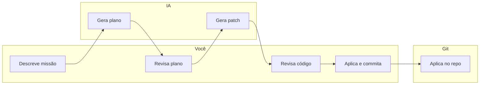

# Posicionamento e copy para landing

> Documento de referência: o que o Dev Command Center entrega e como falar disso (produto e landing page). Linguagem popular, sem foco em detalhes técnicos.

---

## O que é

**O Dev Command Center é uma UI local para executar patches de código com Git, a partir de missões descritas em linguagem natural, sempre com review humano.**

Em uma linha:

**IA aqui é só fonte de patch. Quem decide é o humano. Quem executa é o Git.**

---

## Para quem

Desenvolvedores que querem usar IA para sugerir mudanças no código, mas manter controle total: nada entra no repositório sem revisar antes. Quem quer transparência (ver o plano e o diff) e aplicar as mudanças via Git, no seu ritmo.

---

## O que você faz com o app

- Abre um repositório Git local (seu projeto).
- Cria uma **missão**: título e descrição em português (ou qualquer língua), em linguagem natural — por exemplo: "Migrar checkout para Stripe" ou "Adicionar testes no módulo de pagamento".
- Vê o **plano** sugerido pela IA (etapas, arquivos envolvidos) e revisa na aba Plano.
- Vê o **código** sugerido (original, sugerido, diff por arquivo) e revisa na aba Código.
- **Aplica** só quando aprovar: um clique e as alterações vão para o repositório via Git (com backup).
- **Commita e envia** quando quiser, direto pelo app.

Resumo do fluxo: **você descreve → IA sugere plano e patch → você revisa → Git aplica.**

---

## Por que importa

- **Controle** — Nada é aplicado sem você. A IA só sugere; você decide.
- **Transparência** — Plano e diff ficam visíveis antes de qualquer alteração.
- **Git no comando** — As mudanças entram no repo via Git (patches), rastreáveis e reversíveis.
- **Local** — Tudo roda na sua máquina; seu código e seus dados ficam com você.

---

## Frases para landing / headlines

Use como base para hero, subhero e seções da landing.

### Definição principal

- O Dev Command Center é uma UI local para executar patches de código com Git, a partir de missões em linguagem natural, sempre com review humano.

### Tagline / subhero

- IA aqui é só fonte de patch. Quem decide é o humano. Quem executa é o Git.

### Variações curtas

- Descreva a missão. Revisa o plano e o código. Aplique quando aprovar.
- Código sugerido pela IA, aplicado por você, via Git.
- Linguagem natural → plano e patch → você revisa → Git aplica.

### Benefícios (bullets)

- Nada entra no repositório sem sua revisão.
- Veja o plano e o diff antes de aplicar.
- Patches aplicados pelo Git, com backup.
- Tudo local: seu código, sua máquina.

---

## O que NÃO é

- **Não é autopilot** — A IA não aplica nada sozinha. Você sempre revisa e confirma.
- **Não é a IA editando arquivos direto** — As alterações só entram no projeto quando você clica em aplicar; quem grava no disco é o Git.

---

## Fluxo em uma imagem

Humano no centro: você descreve e revisa; a IA sugere; o Git executa.

---

*Use este doc como referência ao redigir a landing e ao explicar o produto para qualquer audiência não técnica.*
